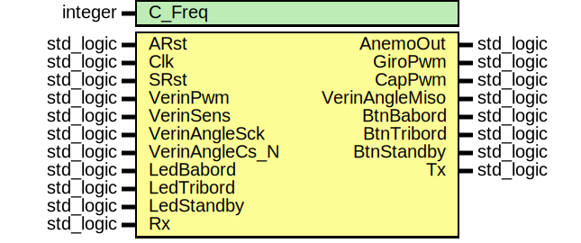

# Simulateur
## Comment l'integrer
Pour integrer le simulateur à votre projet, vous devez ajouter le fichier **Simulator.qip** qui se trouve dans **rtl** à votre projet.

Vous devez ensuite l'instancier le composant **Simu** du fichier **rtl/Simu.vhd** à votre projet. Ex:

```vhdl
library IEEE;
use IEEE.std_logic_1164.all;
use IEEE.numeric_std.all;

entity Top is
    port (
        PinARst_N   : in    std_logic;
        PinClk      : in    std_logic;
        PinLed      : out   std_logic_vector(7 downto 0);
        PinRx       : in    std_logic;
        PinTx       : out   std_logic
    );
end entity Top;

architecture rtl of Top is
    component Mcu is
        port (
            clk_clk       : in  std_logic                    := 'X'; -- clk
            reset_reset_n : in  std_logic                    := 'X'; -- reset_n
            anemo_anemo_in: in  std_logic                    := 'X'; -- anemo_in
            leds_export   : out std_logic_vector(7 downto 0)         -- export
        );
    end component Mcu;
    component Simu is
        generic (
            C_Freq          : integer := 50_000_000
        );
        port (
            ARst            : in    std_logic := '0';
            Clk             : in    std_logic;
            SRst            : in    std_logic := '0';
            AnemoOut        : out   std_logic;
            GiroPwm         : out   std_logic;
            CapPwm          : out   std_logic;
            VerinPwm        : in    std_logic;
            VerinSens       : in    std_logic;
            VerinAngleSck   : in    std_logic;
            VerinAngleMiso  : out   std_logic;
            VerinAngleCs_N  : in    std_logic;
            BtnBabord       : out   std_logic;
            BtnTribord      : out   std_logic;
            BtnStandby      : out   std_logic;
            LedBabord       : in    std_logic;
            LedTribord      : in    std_logic;
            LedStandby      : in    std_logic;
            Rx              : in    std_logic;
            Tx              : out   std_logic
        );
    end component;
    signal Anemo : std_logic;
begin
    uMCU : Mcu
        port map (
            clk_clk         => PinClk,
            reset_reset_n   => PinARst_N,
            anemo_anemo_in  => Anemo,
            leds_export     => PinLed);
    uSimu : Simu
        generic map (
            C_Freq => 50e6)
        port map (
            ARst => '0', Clk => PinClk, SRst => '0',
            AnemoOut => open, GiroPwm => open, CapPwm => open,
            VerinPwm => '0', VerinSens => '0',
            VerinAngleSck => '0', VerinAngleMiso => open, VerinAngleCs_N => '1',
            BtnBabord => open, BtnTribord => open, BtnStandby => open,
            LedBabord => '0', LedTribord => '0', LedStandby => '0',
            Rx => PinRx, Tx => PinTx);
end architecture rtl;
```
## Detail de l'interface
### Entité

### Generics
| Generic name | Type    | Value      | Description |
| ------------ | ------- | ---------- | ----------- |
| C_Freq       | integer | 50_000_000 | Frequence de l'horloge du système |
### Ports
| Port name      | Direction | Type      | Description |
| -------------- | --------- | --------- | ----------- |
| ARst           | in        | std_logic | Reset asynchrone |
| Clk            | in        | std_logic | Horloge système |
| SRst           | in        | std_logic | Reset synchrone |
| AnemoOut       | out       | std_logic | Anémometre |
| GiroPwm        | out       | std_logic | Girouette |
| CapPwm         | out       | std_logic | Bussole / Cap |
| VerinPwm       | in        | std_logic | Vitesse du vérin |
| VerinSens      | in        | std_logic | Sens du vérin |
| VerinAngleSck  | in        | std_logic | Sck du AN MCP 3201 |
| VerinAngleMiso | out       | std_logic | Miso du AN MCP 3201  |
| VerinAngleCs_N | in        | std_logic | Cs_N du AN MCP 3201 |
| BtnBabord      | out       | std_logic | Bouton babord |
| BtnTribord     | out       | std_logic | Bouton tribord |
| BtnStandby     | out       | std_logic | Bouton standby |
| LedBabord      | in        | std_logic | Led babord |
| LedTribord     | in        | std_logic | Led tribord |
| LedStandby     | in        | std_logic | Led standby |
| Rx             | in        | std_logic | Réception UART du simulateur. Utilisé pour s'échanger des donnés avec le PC. Le connecter au Tx du FTDI |
| Tx             | out       | std_logic | Transmission UART du simulateur. Utilisé pour s'échanger des donnés avec le PC. Le connecter au Rx du FTDI |